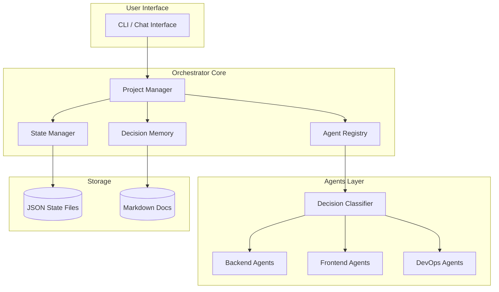

# SPEC.md - Sistema de Orquestación de Agentes

## Visión General

Sistema de orquestación centralizado que funciona como "cerebro"记忆 y coordinación de todos los agentes existentes. Gestiona el estado de proyectos, recuerda decisiones, sugiere siguiente paso y optimiza el flujo de trabajo.

## Arquitectura del Sistema



## Componentes Principales

### 1. Project Manager (PM)

**Responsabilidad**: Centro de coordinación que responde:
- ¿Qué proyecto estamos trabajando?
- ¿En qué fase está?
- ¿Qué necesito hacer ahora?
- ¿Qué falta por hacer?
- ¿Qué ya está hecho?

**API**:
```
pm:status                    → Estado actual del proyecto
pm:next                      → Siguiente tarea pendiente
pm:remaining                 → Lista de tareas pendientes
pm:done                      → Historial de tareas completadas
pm:switch <proyecto>        → Cambiar a otro proyecto
pm:summary                   → Resumen ejecutivo del proyecto
```

### 2. State Manager (SM)

**Responsabilidad**: Persistencia del estado del proyecto en archivos JSON.

**Estructura de archivos**:
```
projects/
├── _index.json              → Lista de todos los proyectos
├── citasbot/
│   ├── state.json           → Estado actual del proyecto
│   ├── tasks.json           → Lista de tareas
│   ├── decisions.json       → Decisiones tomadas
│   └── context.json         → Contexto acumulado
├── cisepro/
│   └── ...
└── landings/
    └── ...
```

**State.json schema**:
```json
{
  "project_id": "citasbot",
  "project_name": "CitasBot SaaS",
  "current_phase": "build",
  "stack": ["Next.js", "Prisma", "Paddle"],
  "last_updated": "2026-02-26T14:00:00Z",
  "health": "active",
  "priority": 1,
  "metrics": {
    "tasks_completed": 15,
    "tasks_pending": 8,
    "agents_used": ["backend", "paddle", "whatsapp"]
  }
}
```

**Tasks.json schema**:
```json
{
  "tasks": [
    {
      "id": "task_001",
      "title": "Implementar WhatsApp bot",
      "status": "done",
      "completed_at": "2026-02-25T10:30:00Z",
      "agent_used": "twilio-whatsapp",
      "notes": "Funcional con intents básicos"
    },
    {
      "id": "task_002", 
      "title": "Dashboard analytics",
      "status": "in_progress",
      "started_at": "2026-02-26T09:00:00Z",
      "agent_needed": ["frontend", "charts"],
      "blockers": []
    },
    {
      "id": "task_003",
      "title": "Email notifications",
      "status": "pending",
      "dependencies": ["task_002"],
      "agent_needed": ["backend", "resend"]
    }
  ]
}
```

### 3. Agent Registry (AR)

**Responsabilidad**: Registro central de todos los agentes disponibles.

**Estructura**:
```json
{
  "agents": {
    "decision-classifier": {
      "path": "classifier/decision-classifier.md",
      "role": "Clasifica decisiones y selecciona agentes",
      "domains": ["architecture", "backend", "frontend", "devops"],
      "always_active": true
    },
    "global-architect": {
      "path": "architecture/global-architect.md",
      "role": "Arquitecto de decisiones críticas",
      "trigger": "high_risk OR architecture_domain"
    },
    "citasbot-stack": {
      "path": "stacks/citasbot.-stack.md",
      "role": "Stack específico CitasBot",
      "projects": ["citasbot"]
    },
    "landing-stack": {
      "path": "stacks/landing-stack.md",
      "role": "Stack Landings con GSAP",
      "projects": ["landing-*"]
    },
    "backend-node": {
      "path": "backend/node-api.md",
      "role": "API Node.js + Express + Prisma",
      "stack": ["node", "express", "prisma"]
    },
    "backend-dotnet": {
      "path": "backend/dotnet-data-sqlserver.md",
      "role": "API .NET + EF Core + SQL Server",
      "stack": ["dotnet", "efcore", "sqlserver"]
    },
    "frontend-react": {
      "path": "frontend/react-hooks.md",
      "role": "React + hooks",
      "stack": ["react", "nextjs"]
    },
    "frontend-vue": {
      "path": "frontend/vue-composition.md",
      "role": "Vue 3 + Composition API",
      "stack": ["vue", "vite"]
    },
    "devops-ci": {
      "path": "devops/ci-cd.md",
      "role": "GitHub Actions pipelines",
      "stack": ["github-actions"]
    },
    "devops-deploy": {
      "path": "devops/deployment.md",
      "role": "Deploy Vercel/Railway/Render",
      "stack": ["vercel", "railway", "render"]
    }
  }
}
```

### 4. Decision Memory (DM)

**Responsabilidad**: Historial de decisiones técnicas tomadas para referencia futura.

**Decisions.json schema**:
```json
{
  "decisions": [
    {
      "id": "dec_001",
      "date": "2026-02-20T10:00:00Z",
      "project": "citasbot",
      "category": "billing",
      "decision": "Usar Paddle en lugar de Stripe por compliance LATAM",
      "rationale": "MoR (Merchant of Record) simplifica taxes para Ecuador",
      "alternatives_considered": ["Stripe", "LemonSqueezy"],
      "consequences": "Comisión más alta pero sin gestión fiscal"
    },
    {
      "id": "dec_002",
      "date": "2026-02-22T14:30:00Z",
      "project": "cisepro",
      "category": "database",
      "decision": "Mantener SQL Server en lugar de migrar a PostgreSQL",
      "rationale": "Legacy compatibility + Azure SQL ya pagado",
      "blocked": false
    }
  ]
}
```

## Flujo de Trabajo del Orquestador

### Inicio de Sesión
```
1. Cargar _index.json → lista de proyectos
2. Cargar último proyecto activo (last_active)
3. Cargar state.json del proyecto
4. Mostrar: "Proyecto: CitasBot | Fase: build | Pendientes: 3"
```

### Ejecución de Tarea
```
1. Usuario describe problema
2. Decision Classifier analiza → domain + risk
3. State Manager carga contexto relevante
4. Agent Registry selecciona agentes
5. Ejecutar agente(s)
6. Actualizar tasks.json (done/in_progress)
7. Guardar en decisions.json si hay decisión técnica
8. Responder con resultado + siguiente paso
```

### Sugerencia de Siguiente Paso
```
pm:next → "Te sugiero trabajar en: Dashboard analytics"
          "Razón: Es bloqueador de email notifications"
          "Agent sugerido: frontend + charts"
          "Dependencias: Ninguna"
```

## Integración con MCP

### Optimización de Tokens

El problema: cada conversación regenera todo el contexto.

**Solución**: Contextos resumidos por proyecto.

```typescript
// Resumen ligero para embedding/context
interface ProjectSummary {
  project_id: string;
  current_phase: "discovery" | "build" | "ship";
  health: "active" | "blocked" | "paused";
  top_priority_task: string;
  recent_decisions: string[];  // último ID de decisión
  agent_stack: string[];      // agentes usados recientemente
}
```

**Estrategia de contexto**:
1. Cargar summary del proyecto (50 tokens)
2. Si tarea específica → cargar solo archivos relevantes (200 tokens)
3. Decisiones completas solo si pregunta directa (500 tokens)
4. Stacks completos solo en primera carga

### MCP Tools Propuestas

```json
{
  "tools": [
    {
      "name": "pm_status",
      "description": "Obtener estado actual del proyecto"
    },
    {
      "name": "pm_next", 
      "description": "Sugerir siguiente tarea"
    },
    {
      "name": "pm_add_task",
      "description": "Agregar nueva tarea"
    },
    {
      "name": "pm_complete_task",
      "description": "Marcar tarea como completada"
    },
    {
      "name": "pm_decision",
      "description": "Registrar decisión técnica"
    },
    {
      "name": "pm_switch",
      "description": "Cambiar a otro proyecto"
    },
    {
      "name": "pm_context",
      "description": "Obtener contexto resumido para el modelo"
    }
  ]
}
```

## Comandos CLI

```bash
# Estado del proyecto actual
pm status

# Ver siguiente tarea
pm next

# Agregar tarea
pm add "Implementar dark mode" --project=citasbot --agent=frontend

# Completar tarea
pm done task_002 --notes="Usando next-themes"

# Registrar decisión
pm decide "Usar Supabase Auth" --reason="Más rápido que auth0"

# Cambiar proyecto
pm use cisepro

# Ver historial
pm history --project=citasbot --limit=10

# Resumen para contexto
pm context --project=citasbot --compact
```

## Comparación con Sistema Actual

| Aspecto | Antes | Después |
|---------|-------|---------|
| Seguimiento | Manual en stacks | Automático en state.json |
| Memoria | Solo en conversación | Persistente en JSON |
| Siguiente paso | No existe | pm:next sugiere |
| Tareas | En markdown | En tasks.json con estado |
| Decisiones | En documentación | En decisions.json buscable |
| Contexto tokens | Todo siempre | Solo lo necesario |

## Plan de Implementación

### Fase 1: Core (Archivos base)
1. Crear estructura `projects/`
2. Crear `_index.json` con tus proyectos
3. Migrar estado de stacks a `state.json`
4. Crear CLI básico

### Fase 2: Integración
1. Crear script Node.js para PM
2. Integrar con Decision Classifier
3. Auto-actualizar estado post-tarea

### Fase 3: MCP
1. Exponer como MCP server
2. Optimizar contexto por proyecto
3. Agregar más features

---

**Inspiración**: Este sistema es como un "project manager" interno que te dice qué hacer, qué falta, y recuerda todo lo que decidiste técnico.
